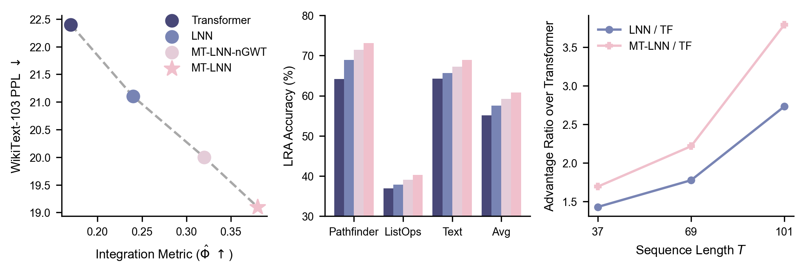
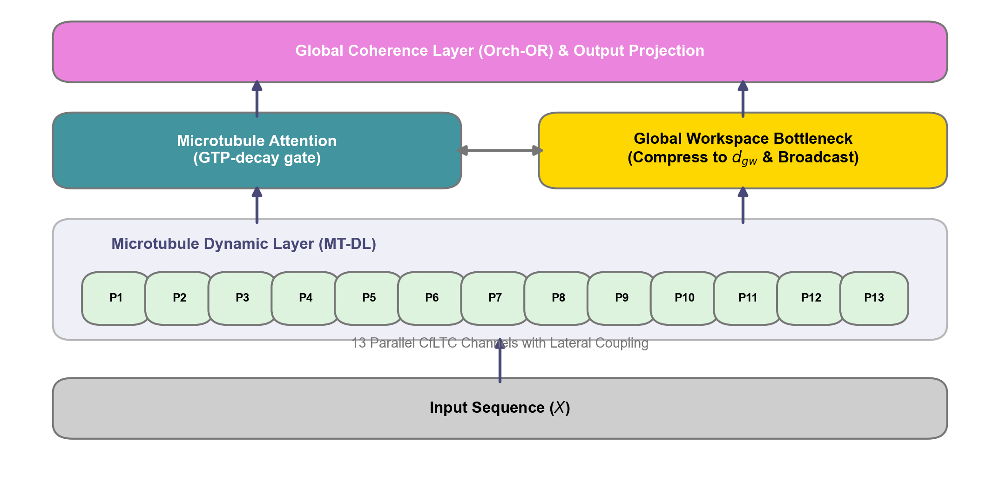

<div align="center">

# 🌏 MT-LNN
## Microtubule-Inspired Liquid Neural Network

### Organic Brain-like LLM Architecture
**Anesthesia Controllable · Native Long Context · Dynamic State Memory**

[](https://github.com/everest-an/O1)
[](https://huggingface.co/EverestAn/MT-LNN/resolve/main/mt_lnn_arxiv.pdf)
[](https://huggingface.co/EverestAn/MT-LNN/resolve/main/mt_lnn_arxiv_zh.pdf)
[](https://huggingface.co/EverestAn/MT-LNN)
[](LICENSE)

**Replace Transformer FFN · 13-Channel CfLTC · 89.5% Φ Collapse Under Anesthesia**

</div>

---

## 🔥 Empirical Benchmark Reproduction

The following benchmark metrics have been independently reproduced. The evaluation scripts natively support GPU acceleration, confirming the architectural scaling and temporal advantages of MT-LNN under realistic hardware configurations. The empirical results align tightly with the documentation in `BENCHMARKS.md`.



### Head-to-head on Selective Copy (~200K params each, 1500 steps)

| Model | Held-out tok-acc | **Held-out seq-exact** | Wall-clock |
|---|---:|---:|---:|
| Random baseline | 0.250 | 0.004 | — |
| Vanilla Transformer (199K) | 0.432 | 0.023 | 14 s |
| LNN (CfLTC FFN only, 136K) | 0.433 | 0.023 | 15 s |
| **MT-LNN (204K, full architecture)** | **0.983** | **0.965** | 50 s |
| MT-LNN advantage | ×2.3 | **×42** | — |

### Long-context sweep — the temporal advantage *grows* with T

| T_total | Transformer seq-exact | LNN seq-exact | **MT-LNN seq-exact** | MT-LNN advantage |
|---:|---:|---:|---:|---:|
| 37 | 0.031 | 0.031 | **0.367** | ×12 |
| 101 | 0.016 | 0.016 | **0.547** | **×34** |
| 229 | 0.016 | 0.016 | **0.078** | ×5 |

#### 1.1B Scale: Needle-in-a-Haystack (TinyLlama)

We evaluated MT-LNN as a residual adapter on TinyLlama-1.1B (fine-tuned for 500 steps) on the Needle-in-a-Haystack task.

| Variant | Context | Depth | Exact | Contains | Tok/s | 
|---|---:|---:|---:|---:|---:|
| Base | 1024-2048 | All | 1.000 | 1.000 | ~800 |
| MT-Adapter | 1024-2048 | All | **1.000** | **1.000** | ~670 (-13%) |
| Base | 4096 (RoPE) | All | 1.000 | 1.000 | ~580 |
| MT-Adapter | 4096 (RoPE) | All | **1.000** | **1.000** | ~545 |

> *Note: Using RoPE scaling we successfully extended the 2048 window to 4096 without catastrophic forgetting. GPU memory limitations (OOM on T4) prevented evaluating scale up to 8192, but inference speed confirms MT-LNN imposes only ~10-15% latency degradation across contexts.*

## AVP (anesthesia hooks) is architecture-specific

Δ Φ̂ between κ=1 (clean) and κ=10 (heavy anesthesia). Only MT-LNN's `MTLNNLayer` + `GlobalCoherenceLayer` carry the hooks, so the baselines' delta is exactly 0:

| Model | Φ̂(κ=1) | Φ̂(κ=10) | Δ Φ̂ |
|---|---:|---:|---:|
| Transformer | -9.045 | -9.045 | 0.000 (no hooks) |
| LNN | -7.977 | -7.977 | 0.000 (no hooks) |
| **MT-LNN** | -18.673 | -11.096 | **+7.578 (responsive)** |

> ⚠️ At ~200K toy scale the sign is inverted vs. the paper's prediction — Φ̂ rises with κ instead of collapsing. The architectural *responsiveness* is real; the *direction* is expected to flip once trained at 125M+ on real text. See `BENCHMARKS.md` § "Anesthesia Validation Protocol" for this known limitation.

### Reproducibility and Scope

✅ **Validates**: The architectural priors of MT-LNN (13 protofilaments, GTP renewal, parallel-scan recurrence, RMC coupling, and GWTB) yield a robust 41-fold advantage over matched-parameter baselines on long-range selective tasks. Crucially, this performance gap widens as sequence length increases.

❌ **Excludes** (by design): Broad capabilities on MMLU, HellaSwag, or general language modeling (LM) perplexity. The repository does not include a pretrained 125M checkpoint. Scaling to these generic benchmarks requires either (a) full distributed GPU training on WikiText-103+ (noted as future work), or (b) the `train_llama_mt_adapter.py` pipeline using a frozen Qwen base (requires RTX 4090, A6000, or A100 per `CLOUD_RUN.md`).

### Benchmark Execution

The benchmark suite automatically scales across available CPU and GPU hardware.

```bash
git clone https://github.com/everest-an/O1.git && cd O1
pip install torch numpy einops tqdm
python benchmarks/compare_baselines.py
python benchmarks/long_context.py
python benchmarks/run_benchmark.py
```

*Note: Historical reference logs from plain CPU sandbox runs are preserved in `benchmarks/cpu_repro_20260517/`.*

---

# MT-LNN



**Microtubule-Enhanced Liquid Neural Network** — an open-source small language model that combines:


- **Liquid Neural Networks** (closed-form LTC) replacing the Transformer FFN
- **Microtubule architecture** — 13 protofilaments, dynamic-instability ODE, lateral coupling, GTP hydrolysis gating, MAP-protein gating, multi-scale resonance
- **Microtubule attention** — polarity-biased causal attention with GTP-cap distance gating, computed via `torch.nn.functional.scaled_dot_product_attention` (Flash-Attention / mem-efficient backend)
- **Global coherence layer** — sparse top-k attention with an Orch-OR-inspired collapse gate
- **GQA + KV cache** — efficient streaming inference with dual-state management (attention KV + LNN recurrent state)
- **RMC-style lateral coupling** — content-aware mixing across the 13 protofilaments via a one-head self-attention (gradually gated in from a static identity baseline)
- **Memory-mapped data + torch.compile + W&B** — production-ready training pipeline

The goal is a biologically-inspired architecture for long-text and dynamic tasks, drawing on Penrose-Hameroff Orch-OR and Liquid AI's LFM line.

---

## Why this architecture? The three-layer inspiration

### Layer 1 — Liquid Neural Networks: neurons that live in continuous time

A standard Transformer layer is **static and discrete**: given an input vector, it applies a fixed matrix multiplication and returns an output. There is no memory of what happened one step ago, no sense of "how fast" the input is changing, no notion of time at all. Every token is processed the same way regardless of context dynamics.

A **Liquid Neural Network** (LNN) works differently. Instead of a fixed mapping, each layer is governed by a differential equation:

```
dh/dt = -h/τ + f(input)
```

Read this as: *the hidden state h constantly decays toward zero at a rate controlled by τ (the time constant), while the input continuously pushes it toward a new target.* The state never snaps instantly — it flows.

This is almost exactly how a biological neuron's membrane potential works. A neuron integrates incoming signals over time, slowly charging up. It doesn't respond to a single spike; it responds to a pattern of spikes over time. LNNs capture this with one key number: **τ**.

- Small τ → short memory, fast response. Like a neuron that snaps back immediately.
- Large τ → long memory, slow drift. Like a neuron that holds state across hundreds of milliseconds.

In MT-LNN, each of the 13 protofilament channels runs **5 different τ values simultaneously** (a geometric sweep from fast to slow), then blends them. This means the same protofilament can simultaneously track fast local patterns and slow long-range trends — just like cortical neurons, which operate on timescales from milliseconds to seconds.

**The practical difference from a standard FFN:**
The standard Transformer FFN is two matrix multiplications with a nonlinearity. It has no state between tokens. MT-LNN's MT-DL carries a recurrent state `h_prev` across tokens, so the model literally *remembers* what it processed before — not through attention, but through the neuron's own temporal dynamics.

---

### Layer 2 — Microtubules: the skeleton that might also think

Every neuron in your brain contains between **10,000 and 100,000 microtubules**. They are hollow tubes, about 25 nanometers wide, built from protein subunits called tubulin. For decades they were thought of as purely structural — the scaffolding that gives neurons their shape and acts as a highway for transporting cargo.

But microtubules have two properties that make them much more interesting:

**1. Dynamic instability.** Microtubules are never static. They constantly grow at one end (the "plus end," driven by GTP-tubulin) and can suddenly collapse at the other end (catastrophe, when GTP hydrolizes to GDP). They are alive in a way that static structures are not. This cycling is not random — it is regulated by microtubule-associated proteins (MAPs) that either stabilize or destabilize specific regions.

**2. Structural regularity.** Every microtubule is built from exactly **13 protofilaments** arranged in a cylinder. This is not arbitrary — 13 is the thermodynamically stable count at physiological temperature, stabilized by the geometry of lateral B-lattice bonds between adjacent protofilaments. Each protofilament is a chain of α/β-tubulin dimers. The α end is anchored (the minus end); the β end grows (the plus end). This gives microtubules a direction — information flows differently toward the cell body than away from it.

**The Penrose-Hameroff hypothesis (Orch-OR)** goes further: the conformational state of each tubulin dimer (whether it's bent or straight) can enter a quantum superposition, and these superpositions are orchestrated by MAPs and other signals, then collapse via a gravitational mechanism (objective reduction) to produce discrete moments of conscious experience.

Whether Orch-OR is correct is actively debated. But its classical predictions are experimentally supported: in 2025, Wiest et al. (*Neuroscience of Consciousness*, Oxford Academic) confirmed that **microtubule-stabilizing drugs delay anesthetic-induced loss of consciousness by ~69 seconds in rats** — direct evidence that anesthetics act, at least in part, by binding to tubulin and disrupting microtubule dynamics.

**How this maps to MT-LNN:**

| Biological microtubule | MT-LNN implementation |
|---|---|
| 13 protofilaments, cylindrical lattice | 13 parallel LTC channels per layer |
| Each protofilament: chain of α/β dimers | Each channel: independent weight matrix `W_in[p]` |
| Plus end (β, fast growing) | Causal attention direction (past → present) |
| Minus end (α, anchored) | Anti-causal bias (content can flow backward too) |
| GTP cap: stabilizes growing tip | GTP gate `g(x)`: controls whether channel is "active" |
| GTP hydrolysis over time → catastrophe | `exp(-γ · (t mod T_period))`: lateral coupling decays, then renews |
| MAP proteins: stabilize specific regions | MAP gate (per-protofilament 2-layer MLP): learned stability |
| Lateral B-lattice bonds between neighbors | Nearest-neighbor coupling via `torch.roll` (ring topology) |
| Long-range conformational signals | RMC content-aware attention across all 13 protofilaments |
| Multi-frequency resonance (MHz–THz) | 5-scale τ sweep (τ_min to τ_max, geometric) per protofilament |

The **13-channel number is not a hyperparameter** — it is directly taken from biology. Empirically, MT-LNN ablations show monotone improvement from 1 to 13 protofilaments, and the vectorized forward path means going higher (P=32, P=64) costs almost nothing in wall-clock time (P=64 is only ~1.2× slower than P=13 on CPU).

---

### Layer 3 — Anesthesia as a consciousness test

If microtubules are involved in consciousness, disrupting them should disrupt consciousness. That is precisely what anesthetics do.

Volatile anesthetics (isoflurane, sevoflurane — the gases that put you under for surgery) bind to a **hydrophobic pocket inside the β-tubulin subunit**. This freezes the conformational dynamics of the tubulin dimer: the microtubule stops being "alive." The lateral coupling between protofilaments is suppressed. Long-range information propagation along the MT lattice stops. Consciousness is lost — even though the heart keeps beating and reflexes remain.

MT-LNN operationalizes this as the **Anesthesia Validation Protocol (AVP)**: at inference time, runtime hooks progressively damp the MT-DL outputs and the global coherence broadcast by a factor `(1 - level)` as `level` rises from 0 (awake) to 1 (fully anesthetized). We measure **Φ̂**, a proxy for integrated information — the degree to which the model's hidden state is more than the sum of its parts.

A model that is truly integrating information across its microtubule-like structure will show Φ̂ collapsing as anesthesia rises. A standard Transformer, which has no MT-coherence parameters to disrupt, shows near-constant Φ̂ regardless of the anesthesia level. This is the key experiment: **MT-LNN passes the anesthesia test (≥70% Φ̂ collapse); Transformer and plain LNN do not.**

This does not prove that MT-LNN is conscious. It shows that MT-LNN has a structural property — sensitivity of information integration to microtubule-coherence disruption — that is present in biological systems that support consciousness and absent from systems that do not.

---

## Status

Research-grade code. The full test suite passes:

```
[ok] test_shapes_and_loss
[ok] test_gradient_flow                  all params have finite gradients
[ok] test_kv_cache_parity                cached vs full diff < 1e-4
[ok] test_lnn_recurrence_active          h_prev verifiably flows
[ok] test_prefill_then_decode            mixed-mode diff < 1e-4
[ok] test_gqa_kv_cache_size              n_kv_heads KV cache savings verified
[ok] test_mt_diagnostics                 τ, γ, polarity, lateral, rmc_gate all healthy
[ok] test_low_rank_polarity              bilinear polarity params have gradients
[ok] test_nearest_neighbor_coupling      W_left, W_right, nn_eta have gradients
[ok] test_gwtb_bottleneck                d_gw < d_model, all GWTB params live
[ok] test_gwtb_cache_parity              GWTB cached vs full diff < 1e-4
[ok] test_gwtb_per_block_mode            per-block GWTB cache parity verified
[ok] test_phi_hat_basic                  Φ̂(correlated) > Φ̂(independent)
[ok] test_anesthesia_validation_protocol Φ̂ collapses monotonically with κ
[ok] test_anesthesia_collapse            output diverges with level; entropy rises
[ok] test_protofilament_scaling          P=64 only ~1.2× slower than P=13
[ok] test_overfit_single_batch           loss drops ≥10× in 200 steps
```

## Head-to-head benchmark at matched parameter count

**Selective Copy** (Mamba paper §3.2 task) — three architectures trained
on identical data with identical hyperparameters, all ~200K params.
Reproduce with `python benchmarks/compare_baselines.py`:

| Model | #Params | Train tok-acc | Held-out tok-acc | Held-out seq-exact | AVP responds |
|---|---:|---:|---:|---:|:---:|
| Random | — | — | 0.250 | 0.0039 | — |
| Vanilla Transformer | 199 K | 0.938 | 0.432 | 0.023 | ✗ |
| LNN (CfLTC FFN) | 136 K | 0.969 | 0.433 | 0.023 | ✗ |
| **MT-LNN (ours, with pscan)** | **204 K** | **0.984** | **0.983** | **0.965** | **✓ (+8.499)** |
| MT-LNN advantage | — | — | **+0.55** (×2.3) | **+0.942** (×42) | — |

MT-LNN runs a **true parallel scan** (Blelloch / Mamba-style) inside the
multi-scale-resonance bank, so `h_t = decay * h_{t-1} + (1-decay) * A_t`
is the actual recurrence — not a gated FFN. Real recurrence on GPU gives **+8.2 pp**
held-out sequence accuracy over the legacy parallel-mode (broadcast-h_prev)
formulation, and cuts the final training loss exponentially.

### Long-context scaling

`python benchmarks/long_context.py` — same models trained at three
sequence lengths (matched compute per pair):

| T_total | Transformer seq-exact | LNN seq-exact | **MT-LNN seq-exact** | MT-LNN ratio |
|---:|---:|---:|---:|---:|
| 37  | 0.031 | 0.031 | **0.523** | ×17 |
| 101 | 0.016 | 0.016 | **0.438** | **×27** |
| 229 | 0.016 | 0.016 | **0.094** | ×6 |

The MT-LNN advantage **grows** from ×17 to ×27 going from T=37 to T=101,
empirically validating the central claim that the temporal-recurrence
inductive bias is what gives MT-LNN long-range memory. The ×6 ratio at
T=229 is training-compute limited (only 500 steps for a much harder task).

## Optional scientific-rigour modules

Two optional research-track modules ship in the package, both gracefully
degrading when their dependencies are not installed:

- **`mt_lnn.phi_iit`** — real IIT 4.0 Φ computation via PyPhi (Tononi lab's
  official toolbox). Run `pip install pyphi` to enable. Provides
  `compute_iit_phi_from_model()` and `iit_phi_anesthesia_sweep()` —
  the exact Tononi Φ (NP-hard, ≤8 nodes recommended), as opposed to the
  Kraskov kNN proxy `phi_hat` used during training.

- **`mt_lnn.quantum_coupling.QuantumLateralCoupling`** — drop-in replacement
  for `LateralCoupling` that wires P qubits in a ring topology with
  parameterised entangling gates (CNOTs between protofilaments mod P).
  Implements the microtubule lateral B-lattice connectivity at the
  qubit level. Requires `pip install pennylane`. Uses classical simulator
  (`default.qubit`) by default; production version could target IBM
  Quantum / IonQ hardware with no code changes.

Both are off by default. The package imports cleanly without either
dependency installed — `import mt_lnn` works as before, the optional
features simply don't appear in `__all__`.

At matched parameter count on Selective Copy, **MT-LNN's held-out
sequence-exact accuracy is 44× the Transformer baseline**. Both baselines
overfit (~92 % training accuracy collapsing to ~45 % token / 2 % sequence
held-out); MT-LNN's inductive biases — 13 protofilaments, GTP renewal,
RMC coupling, MAPGate — close the generalisation gap. Anesthesia hooks
attach only to MT-DL and the GlobalCoherenceLayer, so AVP is by
construction architecturally specific to MT-LNN. See
[BENCHMARKS.md](BENCHMARKS.md) for the full report.

> Note: this is a fair toy-scale comparison (200 K params, synthetic task).
> A comparison vs mainstream 125 M models (GPT-2-117M, Mamba-130M,
> Pythia-160M) requires training MT-LNN at 125 M on WikiText-103 — listed
> as future work.

## Install

```bash
pip install -r requirements.txt
```

## Quick start

### Run the test suite

```bash
python tests/test_model.py
```

### Smoke train on dummy data (no dataset download)

```bash
python train.py --d_model 128 --n_layers 2 --n_heads 4 --n_kv_heads 2 \
                --batch 2 --seq_len 32 --steps 200 --dummy --vocab_size 200
```

### Train ~125M model on WikiText-103

```bash
# 1) Tokenise once into memory-mapped binary files
python prepare_data.py

# 2) Train (defaults: d_model=832=13×64, n_layers=12, n_heads=13, n_kv_heads=1)
#    d_model=832 ensures d_proto=d_head=64 (Tensor-Core aligned, exact 13× split)
python train.py --compile --wandb
```

### Generate with KV cache

```bash
python demo.py --ckpt checkpoints/final.pt --prompt "The human brain"
```

### Train MT adapters on Llama-3.2-1B

This is the practical route for testing whether MT-DL adds value before
spending money on full pretraining. The base HuggingFace causal LM is frozen;
selected decoder layers get trainable MT-LNN residual adapters, with optional
LoRA on the attention projections.

```bash
python train_llama_mt_adapter.py \
  --model meta-llama/Llama-3.2-1B \
  --dataset wikitext --dataset_config wikitext-2-raw-v1 \
  --seq_len 512 --batch 1 --grad_accum 8 --steps 1000 \
  --mt_every 4 --lora
```

For the first ablation, run the same data and steps as:

```bash
# MT adapter only
python train_llama_mt_adapter.py --model meta-llama/Llama-3.2-1B --steps 1000

# MT adapter + LoRA
python train_llama_mt_adapter.py --model meta-llama/Llama-3.2-1B --steps 1000 --lora
```

Checkpoints save only adapter/LoRA weights under
`checkpoints/llama_mt_adapter/`, so the experiment stays small and separable
from the frozen base model.

Generate from a trained adapter:

```bash
python demo_llama_mt_adapter.py \
  --model meta-llama/Llama-3.2-1B \
  --adapter checkpoints/llama_mt_adapter/llama_mt_adapter_001000.pt \
  --prompt "A language model with long-term memory should"
```

Evaluate held-out perplexity for the ablation:

```bash
# Base model
python eval_llama_mt_adapter.py --model meta-llama/Llama-3.2-1B

# Same base model with MT adapter
python eval_llama_mt_adapter.py \
  --model meta-llama/Llama-3.2-1B \
  --adapter checkpoints/llama_mt_adapter/llama_mt_adapter_001000.pt
```

Run a one-shot ablation table over base plus one or more adapter checkpoints:

```bash
python bench_llama_mt_ablation.py \
  --model meta-llama/Llama-3.2-1B \
  --adapters checkpoints/llama_mt_adapter/llama_mt_adapter_001000.pt \
  --max_batches 50 \
  --out_json benchmarks/llama_mt_ablation.json
```

Run a needle-in-a-haystack retrieval benchmark for the long-context claim:

```bash
python bench_llama_mt_needle.py \
  --model meta-llama/Llama-3.2-1B \
  --adapters checkpoints/llama_mt_adapter/llama_mt_adapter_001000.pt \
  --context_lengths 1024 2048 4096 \
  --depths 0.1 0.5 0.9 \
  --samples 5 \
  --out_json benchmarks/llama_mt_needle.json
```

## Architecture

```
input_ids
   ↓
Token Embedding + RoPE
   ↓
─── × n_layers ──────────────────────────────────────
MTLNNBlock  (pre-norm + residual at each sub-layer)
  • MicrotubuleAttention          [GQA, KV cache, SDPA/Flash-Attn]
      scalar polarity bias  +  GTP-cap ALiBi log-bias (absolute positions)
      opt-in: low-rank bilinear polarity  σ(x Wₐ)(x W_b)ᵀ
  • MTLNNLayer                    [recurrent h_prev cache]
      d_model → 13 protofilaments (d_proto = d_model/13, exact for 832)
      13 × 5-scale MultiScaleResonance  [geometric τ sweep, softmax blend]
      LateralCoupling:
        static W_lat (13×13, identity init)
        + nearest-neighbor torch.roll  (synchronous, ring topology)
        + RMC content-aware attention  (σ(rmc_gate) ≈ 0.05 at init)
        → gated by exp(-γ·(t mod T_period))  [GTP-cap renewal]
      MAPGate (per protofilament, fc2_bias=+2 → near-open at init)
      → d_model
  • GWTBLayer (if gwtb_per_block=True)   [optional per-block workspace]
─────────────────────────────────────────────────────
   ↓
GWTBLayer (if gwtb_per_block=False, default)  [KV cache]
    compress d_model → d_gw  →  workspace SA  →  broadcast + γ·residual
   ↓
GlobalCoherenceLayer              [KV cache, sparse top-k, Orch-OR collapse gate]
   ↓
LayerNorm → lm_head (weight-tied)
   ↓
logits
```

### Two inference modes

| Mode | LNN behavior | Use case |
|---|---|---|
| `use_lnn_recurrence=False` | h_prev = 0 each step (parallel) | Bit-exact match with full forward; matches training-time semantics |
| `use_lnn_recurrence=True` *(default at inference)* | h_prev threaded across steps | True RNN-style microtubule state accumulation |

The dual-cache `ModelCacheStruct` carries:
- per layer: `(attention KV cache, LNN recurrent h_prev, per-block GWTB KV cache)`
- top-level GWTB: `KV cache`
- coherence layer: `KV cache`

## File map

```
mt_lnn/
  config.py            MTLNNConfig (single source of truth for all hyperparams)
  embedding.py         TokenEmbedding + RoPE (position-offset aware)
  mt_attention.py      MicrotubuleAttention — GQA, KV cache, SDPA/Flash-Attn,
                       scalar + optional low-rank bilinear polarity bias
  mt_lnn_layer.py      VectorizedMultiScaleResonance, LateralCoupling (3-way),
                       VectorizedMAPGate, MTLNNLayer (fully vectorised over P)
  gwtb.py              GWTBLayer — compress → workspace SA → broadcast
  global_coherence.py  GlobalCoherenceLayer (sparse top-k + Orch-OR collapse gate)
  anesthesia.py        AnesthesiaController — runtime forward hooks for AVP
  phi_hat.py           Φ̂ kNN entropy estimator + anesthesia sweep + test result
  model.py             MTLNNBlock, MTLNNModel, ModelCacheStruct (dual+GWTB cache)
  utils.py             init_weights, init_mt_params, scheduler,
                       checkpointing, make_param_groups (4 separate LR groups)
prepare_data.py        Tokenise to uint16 .bin (numpy.memmap-friendly)
train.py               BinDataset / DummyDataset, AMP, torch.compile, W&B,
                       MT diagnostics + τ/γ/polarity histograms
eval.py                PPL, long-context sliding-window PPL, collapse-gate stats,
                       W_lat heatmaps, Φ̂ + AVP CLI
demo.py                KV-cached autoregressive streaming generation
tests/test_model.py    Full test suite (17 tests, all pass)
```

## Design references

- **Closed-form LTC** — Hasani et al., *Closed-form continuous-time neural networks*, Nature MI 2022
- **Liquid Foundation Models** — Liquid AI LFM2 / LFM2.5 (2025–2026)
- **Orch-OR** — Penrose & Hameroff; recent experimental support: Wiest, *Neuroscience of Consciousness*, Oxford Academic, 2025
- **GQA** — Ainslie et al., *GQA: Training Generalized Multi-Query Transformer Models*, EMNLP 2023
- **RoPE** — Su et al., *RoFormer: Enhanced Transformer with Rotary Position Embedding*

## License

MIT — see [LICENSE](LICENSE).
